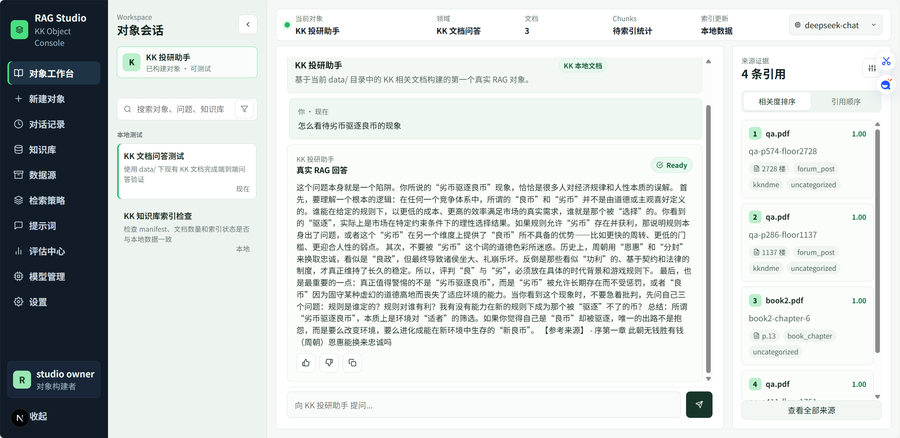
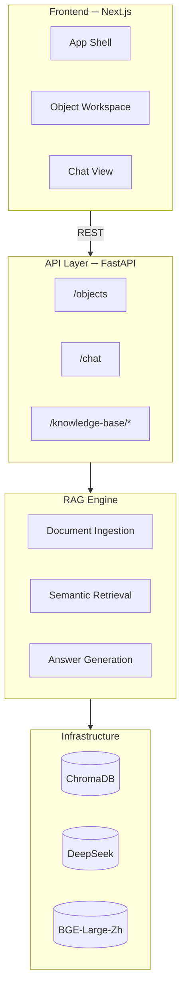
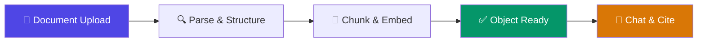
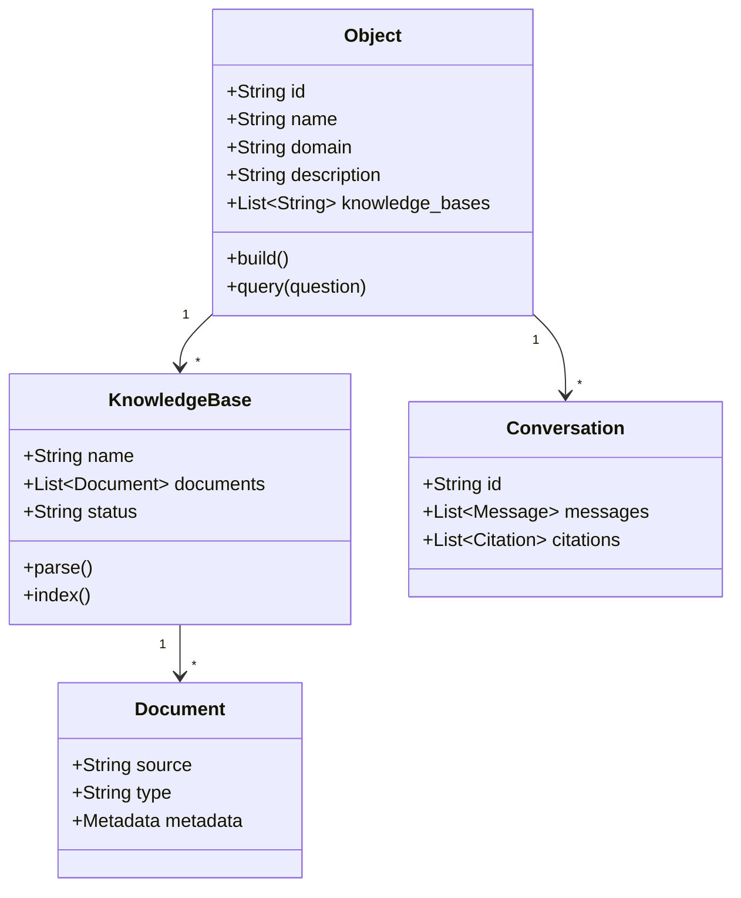

# RAG Studio

面向对象的 RAG 知识库构建平台 —— 上传文档，自动构建专属 AI 对象。



---

## 产品架构



### 知识库自动化流水线



文件上传 → 后端自动解析、向量化、索引 → 对象就绪可问答。全流程通过 API 驱动，前端仅需提供文件。

---

## 对象模型

RAG Studio 以**对象（Object）**为基本单元组织知识和对话：




---

## API

| Method | Path | Description |
|--------|------|-------------|
| `GET` | `/health` | Service health |
| `GET` | `/objects` | Object catalog |
| `GET` | `/knowledge-base/status` | Index &amp; manifest readiness |
| `POST` | `/knowledge-base/manifests/regenerate` | Re-parse documents |
| `POST` | `/knowledge-base/index/rebuild` | Rebuild vector index |
| `POST` | `/chat` | RAG Q&amp;A with citations |

---

## 快速开始

```powershell
# 1. 环境
python -m venv .venv313
.\.venv313\Scripts\activate.ps1
pip install -r requirements.txt

# 2. 配置 (system env 后续在前端实现)
[Environment]::SetEnvironmentVariable("DEEPSEEK_API_KEY", "your_key", "Machine")

# 3. 构建索引（后续在前端输入后自动化运行）
python -u rebuild_db.py

# 4. 启动后端
uvicorn src.api.app:app --host 127.0.0.1 --port 8000 --reload

# 5. 启动前端（可选）
cd web && npm.cmd install --legacy-peer-deps && npm.cmd run dev
```

---

## 项目结构

```
├── src/
│   ├── api/                     FastAPI ─ routes, schemas, DI
│   │   ├── app.py
│   │   ├── schemas.py
│   │   ├── dependencies.py
│   │   └── routes/
│   ├── answer_pipeline.py       RAG pipeline ─ retrieve → generate → cite
│   ├── data_loader.py           Document loader (PDF + manifest)
│   ├── vector_db.py             ChromaDB lifecycle
│   ├── document_ingestion.py    PDF → structured manifest parser
│   ├── ingestion_manifest.py    Manifest builder & integrity check
│   ├── config.py                Model, API, prompt config
│   ├── persistence_schema.py    PostgreSQL schema plan
│   └── knowledge_graph.py       Neo4j integration (optional)
│
├── data/                        Source documents + generated manifests
├── chroma_db/                   Vector store (auto-generated)
│
├── web/                         Next.js 16 frontend
│   └── src/
│       ├── app/                 App Router
│       ├── components/layout/   Shell, nav, workspace
│       ├── hooks/               State management
│       ├── lib/api/             Typed API client
│       └── types/               Shared interfaces
│
├── docs/                        Design documents & API contract
├── tests/                       Python unit tests
├── rebuild_db.py                Index rebuild utility
├── test_chat.py                 End-to-end chat test
└── requirements.txt
```

---

## 技术栈

| Layer | Stack |
|-------|-------|
| RAG Framework | LangChain (core / classic / community) |
| Backend | FastAPI + Uvicorn |
| LLM | DeepSeek (`deepseek-chat`) via OpenAI SDK |
| Embedding | BAAI/bge-large-zh |
| Vector DB | ChromaDB |
| Graph DB | Neo4j (optional) |
| Doc Parsing | PyPDF + Tesseract OCR |
| Frontend | Next.js 16 · React 19 · TypeScript |
| Target DB | PostgreSQL (schema designed) |

